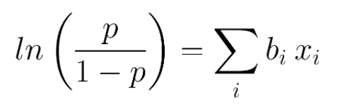
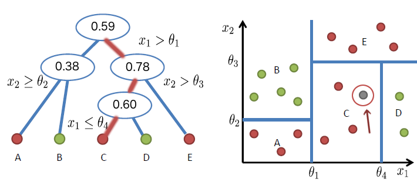
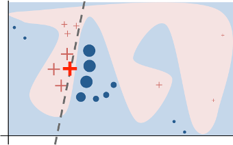
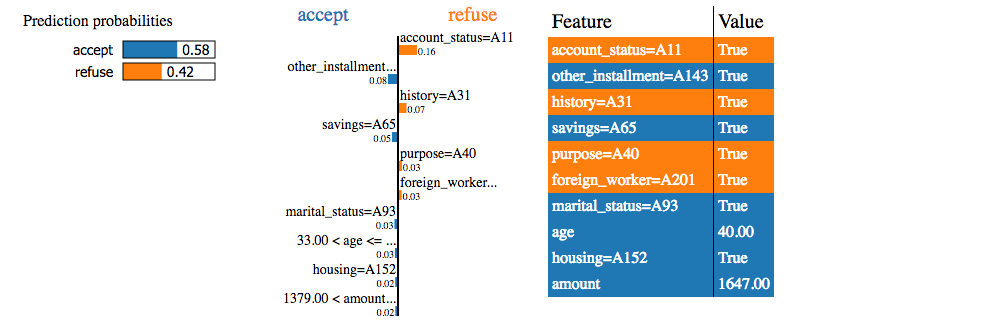
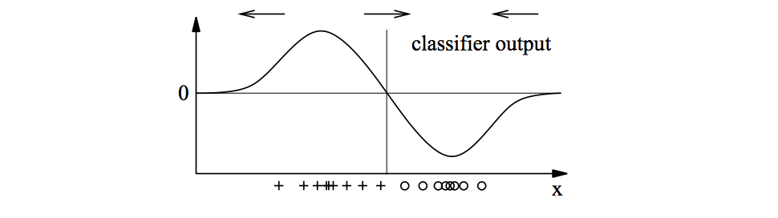

# Prediction explanations

* [Example](#example)
* [Example2](#example2)
* [Third Example](#third-example)
    * [Why explaining individual predictions](#why-explaining-individual-predictions)
        * [The EU regulation](#the-eu-regulation)
    * [How we can do it](#how-we-can-do-it)
    * [Model dependant methods](#model-dependant-methods)
        * [Linear models](#linear-models)
        * [Tree-based algorithms](#tree-based-algorithms)
    * [Model-independant explanations](#model-independant-explanations)
        * [Lime](#lime)
        * [Explanation vectors](#explanation-vectors)
        * [An interesting way of using Game Theory](#an-interesting-way-of-using-game-theory)

### Why explaining individual predictions

Machine learning models and algorithms often come as black boxes for the end
user. They are good at finding mappings between a set of features and a target,
but they do not really describe the underlying relationship between a given set
of feature and the prediction made by the model.

In many cases, what we would be interested in would be to know not only the
prediction, but also *why* such a prediction has been made by the model, on which
feature the model based it prediction, and what to turn the model output into
something else. This is especially true when a decision is taken by a human who
relies on a machine learning algorithm: the decision maker should have a proof,
or at least good insights, that the decision would lead to the best result.

Typical examples could be:

- In fraud detection: why has this person been predicted as a fraudster?
- In predictive maintenance: why is it supposed to break, and what can we do about it?
- In pricing prediction: which features tends to lower or increase the price of this product?

In all of these use cases, prediction explanation can help decisions to be made.

#### The EU regulation

This is going to become a field of major importance soon as the European Union
will grant a **right to explanation for european citizens**: when a decision that concerns
directly an individual will be taken by an algorithm, this person could ask the
decision maker why such a decision has been made. In Machine Learning, this
means for companies to be able to extract explanations automatically even from
black-boxes algorithms.

This right to explanation has been stipulated in the General Data Protection
Regulation (GDPR) and adopted by the parliament in April 2016. It will go into
effect starting in April 2018. This regulation bans decisions “based solely on
automated processing, including profiling, which produces an adverse legal
effect concerning the data subject or significantly affects him or her.” This
means **at least one human being** in the process. This is why automating
explanation is going to be a key issue in the following years: no man can
reasonably find explanations for a decision taken by the complex models widely
used today.

You can read more in [this article](http://fusion.net/story/321178/european-union-right-to-algorithmic-explanation/)
or in [this paper](https://arxiv.org/pdf/1606.08813v3.pdf).

### How we can do it

What we want is to **measure the influence of each feature** and extract the most
important ones that contributed to a specific prediction by the model.

Several methods has been published and are being developped. They can mainly be
classified into model-dependant and model-independant explanation system.

### Model dependant methods

The first solution is to look at how a given model actually works, and try to
extract each feature contribution.

#### Linear models

By definition linear models are the easiest to interpret without an on-top
explanation algorithm: one only has to look at the coefficients to see the
relative importance of each variable.

We can also compute the direct contribution to the outcome: the output depends
directly on the sum of the feature value times the regression coefficient, plus
some overall bias. So on a prediction level, multiplying each regression
coefficient by the feature value give the direct influence of the feature value
on the prediction.

For linear regression, output is actually equal to the sum of each contribution (plus the bias). For classification, with a logistic regression for instance, the dependance involves a logarithm. But the linear part can still be decomposed onto seveal contributions from each feature. 

*The Logistic Regression output probability, functions of the linear mapping*

Moreover, the coefficient directly gives an idea on how the prediction is going
to evolve when perturbing a feature.

#### Tree-based algorithms

For a decision tree, extracting features contributions means check the path in
the tree to reach a given point. In the case of a regression, this path would
lead to the value associated with the example that is being scored, while in
the binary classification case this path would lead to one of the classes (0 or
1).

Here is an example on binary classification where the grey dot is being
classified by the Decision Tree:

Each split on the path moves the prediction up or down, and at each split a
single feature is involved. So computing the output difference at each split
will indicate the feature influence for that split. For a given feature, we can
sum up the contributions for all the splits this is feature is involved. Thus,
the output predictions can be written:

*P(y = red | x1, x2) = Global_Bias + ∑ contribution_f(x)*

On the tree example above, we would have:
- contribution from x1: 0.59
- contribution from x2: -0.18
- global bias: 0.59
which means that x1 has a bigger importance in the classification decision of
the grey dot into the red class.

For ensemble methods such as Random Forests and Gradient Boosted Trees, each
feature contribution is simply the average of each decision tree's feature
contribution.

You can find **an implementation of this method
[here](https://github.com/andosa/treeinterpreter) and it has been tested on a
house pricing dataset [on this notebook](treeinterpreter.ipynb).**

Yet, even if this method is interesting to identify the important features
involved in the prediction, it lacks a sign: it's not possible to know whether
x1 should be increased or decreased to switch the outcome of the prediction.

### Model-independant explanations

The problem that comes with model independant explanations is that they often
can't be compared between each others. Two different models on the same data
would lead to two different kind of explanations that would be difficult to
compare. So having an explainer that would work on every kind of model would be
very useful.

#### Lime

Lime stands for Locally Interpretable Model-agnostic Explanations. It's a local
approximation of a complicated model by a interpretable one, namely a linear
model.

It is based on this article: ["Why Should I Trust You?": Explaining the
Predictions of Any Classifier](https://arxiv.org/abs/1602.04938).

Lime starts by **sampling many points around** the interesting point, then it
**weights each one of them** by a kernel depending of the distance from the
original point, and **fits a linear model** between these samples and their
predicted value by the model. So it is a local approximation of the model
outcome around the line we want to explain.

The important parameters here are:

- `kernel_width` which controls the width of the weigthing kernel. The smaller, the more local explanations are.
- `num_features` that limits the number of displayed features. Note that Lime performs a feature selection before fitting a linear model, so changing this parameter actually changes the output for top features!

**[An implementation](http://github.com/marcotcr/lime) has been released** on
github by the author. And here is **[a wrapper](lime_wrap)** that makes the use
of Lime a bit easier.

Lime works on various type of data and models. Here you can find several
notebooks on text and numerical data: 

- [On a credit dataset - classification](german_credit.ipynb)
- [On a house prices dataset - regression](houses.ipynb) 
- [On recipes ingredients dataset - text data](whatscooking.ipynb)

But note that **Lime does not work yet on datasets with text and tabular
data**. In that case you should turn all your data into numbers, including your
text, using a count vectorizer or a tfidf for instance.

#### Explanation vectors

Another way to locally explain the prediction is to compute the gradient of the
model output arount the point. This is quite similar to lime because the
derivative is a linear approximation of the model output, but instead of
sampling a synthetic dataset, we can recover this model output distribution
with a kernel density estimation. Once the desity is recovered using a gaussian
kernel for instance, it's then easy to compute the gradient which is then
called an *explanation vector*.

Check [this article](http://www.jmlr.org/papers/volume11/baehrens10a/baehrens10a.pdf)
from the journal of ML research.

#### An interesting way of using Game Theory

In [an article from 2009](http://lkm.fri.uni-lj.si/xaigor/slo/pedagosko/dr-ui/JMLR-Strumbelj-Kononenko.pdf)
two researchers described an explanation of individual prediction by making a
parallel between coalitions in a game and feature contributions. In Game
Theory, it's possible to compute for each play his/her Shapley value, which is
an indicator on how much influence in average he would have if he were to
engage in a coalition of players. For instance at the Council of the European
Union, each state has a number of votes which is proportional to its
population, so bigger countries like Germany or France has a greater Shapley
value than smaller ones because when they get into a coalition, they increase
the coalition's chances to win the vote. And small countries like Luxembourg
have a small Shapley value because their small number of votes don't bring much
power to the coalition.

So in a group of features, the idea is to determine which feature has the most
influence, either alone or combined with other features. Computing the Shapley
value for each feature can therefore give a good insight on how much it
influences the prediction.

Nonetheless, this methods has a complexity of O(2^n), because it needs to look
at each subset of features. This is why the author propose an approximation to
the exact Shapley value.

